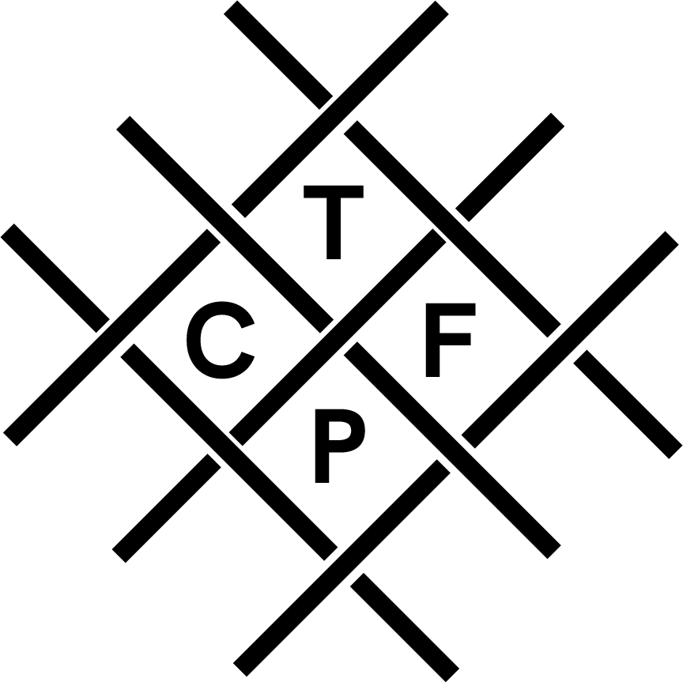

#   Pins for the Commons Fabric Project 

> *Behold, a simple static page to track project pins.*

## Pinned Tools & Workspaces

| | | **Note** |
| --- | --- | --- |
| *Project Pins* | 🌐 [**PageLink**](https://lukavuko.github.io/cfp.github.io) | Hosted via github.io |
| *Communication* | [ **Zulip**](https://tcfp.zulipchat.com/) | Primary communication channel
| *Documents*       | [ **Google Drive**](https://drive.google.com/drive/u/0/folders/12QQRE1ZgXhLJrIxDnqM4yZkCBlrzR-y0) | Repository of shared documents |
| *Research* | [  **Zotero**](https://www.zotero.org/groups/6338490/commons-fabric/items/TKAZWTKI/library) | CFP specific research library |
| *Project Management* | [ **Trello**](https://trello.com/invite/b/69cc956d727124f773e2bafc/ATTIa2e72aac0da2ea239611c655235c56be18155FFF/the-commons-fabric-project) | Progress and requirements tracking (open to alternatives) |
| *UI/UX Design* | [  **Figma**](https://www.figma.com/community/file/1620970671263316616) | Design mockups |
| *Architecture* | *TBD* | Coming soon |
| *Data Model* | [ **dbdiagram.io**](https://dbdiagram.io/d/CFP-proto-db-model-69cc90cefb2db18e3b5114bb) | Database schema |
| *Code Repository* | *TBD* | Coming soon |

<!--  -->

## Distinguished Resources

A non-exhaustive list of useful and key documents/sources available and contributed by team members.

| **Resource** | **Authorship** |
| --- | --- |
| [📊 Survey Results & Analysis](https://www.canva.com/design/DAHEOHZpYKI/28azPMAxxnwvIZKplNUn3Q/edit) | S. Guerrero |
| [🏠 Commons Fabric Project Site](https://commonsfabric.ca/?referrer=luma) | M. Peacock |
| [📋 Product Requirements Specification (v3)](https://docs.google.com/document/d/1XTXcCaKjmw1Kqcr2BH44gQjJPnHhVlwS/edit) | R. Clarke |
| [📅 Calendar Ideation](https://docs.google.com/document/d/145Tjj4XUg5hRhZTW2nca89PMVU-tb1shg3rAdfUHkHo/edit?tab=t.0#heading=h.vlv415tj7tsw) | .S. Wu |
| [💬 "Reddit but good"](https://docs.google.com/document/d/17Ba0bHxs1N9U0cuk3NAbk1yxNSymTbH37lyRIMB_otI/edit?tab=t.0#heading=h.6958drfkxzud) | M. Boulerice |
| [🎓 Max's Thesis](https://docs.google.com/document/d/1JKy08pEw7GAQfOXo77ULcjIYjRG5lGhl/edit?tab=t.0) | M. Peacock |
| [📝 Raw Survey Responses](https://docs.google.com/spreadsheets/d/1pV_DqmPz2Fy9L_l9_I9GYmmRV6MJIx4SmOfzqNRhCC8/edit?gid=1219648507#gid=1219648507) | S. Guerrero |
| [🏘️ Rideau Community Hub](https://rideaucommunityhub.tracottawa.ca/current-organizations-2/) | - |

## Contributing

To add or update a link, edit this `README.md` file directly on the `main` branch and submit a pull request. Changes will automatically deploy to the live site when merged.
