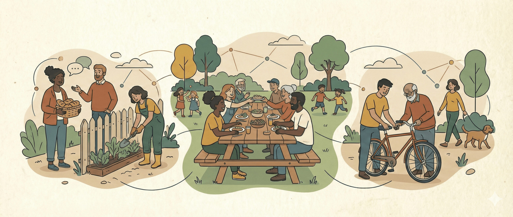

# Pinned Workspaces

![Last Updated][badge-updated]
![Issues][badge-issues]
[![Status][badge-status]][actions-url]

> *Behold, a simple static page to track project pins.*

---

## Tools & Workspace Navigation

| Workspace | Note |
| --- | --- |
| [![ ][ico-zulip] **Zulip**][zulip] | *Comms channel* |
| [![ ][ico-gdrive] **Google Drive**][gdrive] | *Document store* |
| [![ ][ico-trello] **Trello**][trello] | *Project management* |
| [![ ][ico-figma]  **Figma**][figma] | *UI/UX Design and Mockups* |
| [![ ][ico-github]][code-repo] | *POC Lab (primary code repository)* |
| [![ ][ico-zotero] **Zotero**][zotero] | *Group Research Lib* |
| [![ ][ico-dbdiagram] **dbdiagram.io**][dbdiagram] | *Data Modeling* |
| *Coming soon* | *Live/Html Mockups Directory* |

## Pinned Internal Resources

A non-exhaustive list of key contributions, documents, and resources by to the Commons Fabric team. These are generally organized with the newest resources at the top.

| **Resource** | **Maintained By** |
| --- | --- |
| 💎 [Our Value Proposition][value] | *...is on the way* |
| 🦄 [Our Internal App][poc-deployed] | *...is on the way* |
| 📒 [Focus Group Plan][focus] | |
| ✔️ [Feature Tracker][feature-excel] | |
| 📋 [Produce Requirements Spec][product-spec] | R. Clarke |
| 📝 [Weekly Notes][meeting-notes] | M. Peacock |
| 🛠️ [Architecture File][architecture] | L. Vukovic |
| 📅 Calendar [Ideation][s-calendar] and [Mockup][s-mockup] | S. Wu |
| 📊 Survey [Results][survey-raw] & [Analysis][survey-analysis] | S. Guerrero |
| 💬 ["Reddit but good"][reddit-good] | M. Boulerice |
| 🎓 [Thesis Work][thesis] | M. Peacock |
| 📚 [Literature Review][lit-review] | L. Vukovic |
| *More to come!* | ... |

## Pinned External Resources

| **Resource** | **Note** |
| --- | --- |
| [🏘️ Rideau Community Hub][rideau-hub] | *RCH site and our reference point* |
| [🏠 Commons Fabric Site][cf-site] | M. Peacock |
| [📊 Ottawa Open Data][open-ottawa] | Using open data to make Ottawa better. |
| *More to come!* | ... |

### A Mockups Ta

---

### Contributing

To add or update a link, edit this `README.md` file directly on the `main` branch and submit a pull request. Changes will automatically deploy to the live site when merged.

<!-- ===================== REFERENCE LINKS ===================== -->

<!-- Tool links -->
[zulip]:     https://tcfp.zulipchat.com/
[gdrive]:    https://drive.google.com/drive/u/0/folders/12QQRE1ZgXhLJrIxDnqM4yZkCBlrzR-y0
[zotero]:    https://www.zotero.org/groups/6338490/commons-fabric/items/TKAZWTKI/library
[trello]:    https://trello.com/invite/b/69cc956d727124f773e2bafc/ATTIa2e72aac0da2ea239611c655235c56be18155FFF/the-commons-fabric-project
[figma]:     https://www.figma.com/community/file/1620970671263316616
[code-repo]: https://http.cat/status/404
[dbdiagram]: https://dbdiagram.io/d/CFP-proto-db-model-69cc90cefb2db18e3b5114bb

<!-- links collection -->

[value]:           https://www.forbes.com/sites/michaelskok/2013/06/14/4-steps-to-building-a-compelling-value-proposition/
[poc-deployed]: https://http.cat/status/404
[focus]:           https://docs.google.com/document/d/1SrgYS0Y4KsL54IqZlNKmJWhmc2GDdjggoW7YzO0rdrI/edit?usp=sharing
[product-spec]:    https://docs.google.com/document/d/1l4Omk_xz0alz8nfUTFa-8ajL6ipQ_R_V/edit
[feature-excel]:   https://docs.google.com/spreadsheets/d/1fhw5SeE6cqZjFGvWvraetnSg60Hf_rZ8pyj_47yDhe8/edit?gid=1913040094#gid=1913040094
[meeting-notes]:   https://drive.google.com/drive/folders/1NwcXL2ZMDYdHpNuf-0MrzVYwHA03Yu_c?usp=drive_link
[architecture]:    https://github.com/lukavuko/commons-fabric-poc/blob/main/1_ARCHITECTURE.md
[s-mockup]:   https://drive.google.com/drive/folders/15h6qvb9JA9q0zLJ0Kfy0g1VJqotkyAce
[s-calendar]:      https://docs.google.com/document/d/145Tjj4XUg5hRhZTW2nca89PMVU-tb1shg3rAdfUHkHo/edit?tab=t.0#heading=h.vlv415tj7tsw
[reddit-good]:     https://docs.google.com/document/d/17Ba0bHxs1N9U0cuk3NAbk1yxNSymTbH37lyRIMB_otI/edit?tab=t.0#heading=h.6958drfkxzud
[thesis]:          https://docs.google.com/document/d/1JKy08pEw7GAQfOXo77ULcjIYjRG5lGhl/edit?tab=t.0
[survey-analysis]: https://www.canva.com/design/DAHEOHZpYKI/28azPMAxxnwvIZKplNUn3Q/edit
[survey-raw]:      https://docs.google.com/spreadsheets/d/1pV_DqmPz2Fy9L_l9_I9GYmmRV6MJIx4SmOfzqNRhCC8/edit?gid=1219648507#gid=1219648507
[lit-review]:      https://www.zotero.org/groups/6338490/commons-fabric/items/TKAZWTKI/reader

[rideau-hub]:  https://rideaucommunityhub.tracottawa.ca/current-organizations-2/
[cf-site]:        https://commonsfabric.ca/?referrer=luma
[open-ottawa]: https://engage.ottawa.ca/openottawa

<!-- ===================== ICONS/BADGES ===================== -->

<!-- Favicons -->
[ico-zulip]:     https://www.google.com/s2/favicons?domain=zulipchat.com&sz=12
[ico-gdrive]:    https://www.google.com/s2/favicons?domain=drive.google.com&sz=12
[ico-zotero]:    https://www.google.com/s2/favicons?domain=zotero.org&sz=12
[ico-trello]:    https://www.google.com/s2/favicons?domain=trello.com&sz=12
[ico-figma]:     https://www.google.com/s2/favicons?domain=figma.com&sz=12
[ico-dbdiagram]: https://www.google.com/s2/favicons?domain=dbdiagram.io&sz=12
[ico-github]:    https://www.google.com/s2/favicons?domain=github.com&sz=12

<!-- Badges -->
[badge-updated]: https://img.shields.io/github/last-commit/lukavuko/cfp.github.io?label=last%20updated
[badge-issues]:  https://img.shields.io/github/issues/lukavuko/cfp.github.io
[badge-status]:  https://github.com/lukavuko/cfp.github.io/actions/workflows/static.yml/badge.svg
[actions-url]:   https://github.com/lukavuko/cfp.github.io/actions/workflows/static.yml
